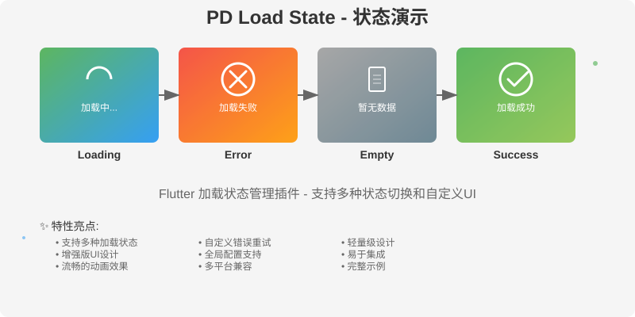

# pd_load_state

这是一个针对网络请求的不同状态对应的 UI 页面封装,
对某一个`widget`快速添加不同请求状态的 UI 页面，方便快速开发。

This is a UI page encapsulation that corresponds to different states of network requests,
allowing for quick addition of UI pages with different request states to a certain 'widget' for easy and rapid development.

## 功能演示 Feature Demo

<div align="center">
  
</div>

> 🎨 **增强版UI设计** - 支持现代化的加载动画、优雅的渐变效果和流畅的状态转换
> 
> 📱 **多平台支持** - 完美适配 Android、iOS、Web、macOS、Windows、Linux
> 
> ⚡ **轻量高效** - 简单易用的API设计，快速集成到现有项目

## 安装 Installation

要使用此包，请将以下内容添加到您的`pubspec.yaml`文件中：

To use this package, add the following to your `pubspec.yaml` file:

```yaml
dependencies:
  pd_load_state: ^0.2.1
```

执行 implement

```bash
flutter pub get
```

## 用法 Usage

对于使用示例参考`/example`文件夹中的代码。

For using examples, refer to the code in the `/example` folder.

引用`pd_load_state`库
import 'package:pd_load_state/pd_load_state.dart';

```dart
import 'package:pd_load_state/pd_load_state.dart';
```

简单的使用

Simple use

```dart
// 如果想让这个组件展示加载状态，可以按照下面的方式实现。
class SimpleExample extends StatefulWidget {
  const SimpleExample({super.key});

  @override
  State<SimpleExample> createState() => _SimpleExampleState();
}

class _SimpleExampleState extends State<SimpleExample> {
  // 初始化组件状态控制对象
  // 控制对象默认会执行加载中状态.
  final PDLoadState loadState = PDLoadState('SimpleExample');


  @override
  Widget build(BuildContext context) {
    // 使用[PDLoadStateLayout]包裹某一个组件.
    return PDLoadStateLayout(
      // 必传 绑定的[PDLoadState] 用来控制组件的状态切换。
      loadState: loadState,
      // 在加载状态时执行的回调, 在这里发送网络请求.
      onLoading: network,
      // 必传 加载状态成功时要执行的函数, 返回一个要展示的ui组件。
      builder: (context) {
        return const Center(
          child: Text('Simple example'),
        );
      },
    );
  }

  /// 模仿一次网络请求。
  void network() {
    Future.delayed(const Duration(seconds: 3)).then((_) {
      if (Random().nextBool()) {
        // 模拟请求成功, loadState.success() 会让页面回到加载成功状态
        // 默认情况下 每次调用这个函数都会刷新[PDLoadStateLayout]包裹的组件
        loadState.success();
      } else {
        loadState.error();
      }
    });
  }
}
```

组件状态控制对象说明

Description of Component State Control Objects

```dart
// 初始化组件状态控制对象
// 控制对象默认会执行加载中状态.
final PDLoadState loadState = PDLoadState('SimpleExample');
// 状态枚举属性
loadState.state;
// 如果是请求错误时的自定义错误文本
loadState.errorMessage;
// 控制对象的身份标识, 用来区分多个组件的状态切换
loadState.identifier;
// 是否刷新[PDLoadStateLayout]包裹的组件.
// 为`true`时, 每次调用函数`loadState.success();`都会刷新[PDLoadStateLayout]包裹的组件
loadState.isRefreshSubviews;
```

`PDLoadState` 是一个组件状态控制对象，用来控制组件的状态切换。

如何切换页面的不同状态?

How to switch between different states of a page

```dart
// 调用函数切换

// 网络请求成功
loadState.success();
// 网络请求失败
loadState.error();
// 网络请求加载中
loadState.loading();
```

或者 用状态枚举直接赋值, 内部重写了`status`的`set`方法实现刷新.

```dart
set status(PDLoadStateEnum newValue) {
    _update(newValue);
}
```

```dart
// 网络请求成功
loadState.state = PDLoadStateStatus.success;
// 网络请求失败
loadState.state = PDLoadStateStatus.error;
// 网络请求加载中
loadState.state = PDLoadStateStatus.loading;
loadState.state = PDLoadStateStatus.reload;// 重新加载
```

各个状态页面的 ui 级别说明

UI level description of each status page

示例 Example `loadingWidget`

通过`[PDLoadStateLayout]`类中参数`loadingWidgetBuilder`设置的 UI, 优先级最高 Highest priority

```dart
PDLoadStateLayout(
  loadState: loadState,
  onLoading: network,
  builder: (context) {
    return const Center();
  },
  /// 优先级最高
  loadingWidgetBuilder: (context) {
    return const Center(
      child: Column(
        mainAxisAlignment: MainAxisAlignment.center,
        mainAxisSize: MainAxisSize.min,
        children: [
          Text('loading...'),
        ],
      ),
    );
  },
)
```

`PdLoadStateConfigure`类配置,设置一次全局使用. 优先级中等 Medium priority

```dart
/// 自定义加载中页面
PdLoadStateConfigure.instance.loadingWidgetBuilder = (context) {
   return SizedBox(
     width: MediaQuery.of(context).size.width,
     child: const Center(
       child: Row(
         mainAxisAlignment: MainAxisAlignment.center,
         children: [
           CircularProgressIndicator(),
           Text('加载中...'),
         ],
       ),
     ),
   );
};
```

如果上面两种都没有设置, 则使用默认加载中页面, 优先级最低 Lowest priority

```dart
PDLoadStateDefaultWidgets(backgroundColor: backgroundColor).loadingView;
```

更多详细用法请参考`/example/lib/main.dart`文件中的代码。

For more detailed usage, please refer to the code in the `/example/lib/main.dart`.

## 支持和社区 Support and Community

- [Gitee Repository](https://gitee.com/peiduo_734386_admin/pd_load_state)
- [GitHub Repository](https://github.com/peiduo/pd_load_state)
- [pub.dev Package](https://pub.dev/packages/pd_load_state)

### 问题反馈 Issue Reporting
如果您在使用过程中遇到问题或有功能建议，请通过以下方式联系我们：
- 在 GitHub 或 Gitee 上提交 Issue
- 发送邮件至开发者邮箱

### 贡献指南 Contributing
我们欢迎社区贡献！如果您想为项目做出贡献，请：
1. Fork 项目仓库
2. 创建功能分支
3. 提交您的更改
4. 发起 Pull Request

## 许可证 License

此软件包根据 [MIT License][MIT] 获得许可。

This package is licensed under the [MIT License][MIT] .

<!-- 相关 url -->

[MIT]: https://gitee.com/peiduo_734386_admin/pd_load_state/tree/master/LICENSE
